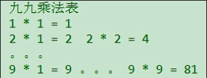

```java
public class NestedLoop {
    public static void main(String[] args){
        //上半部分 遍历行数  
        for (int i = 0; i < 5; i++){
            //每一行打印的空格
            for (int j = 0; j < 4 - i; j++){
                System.out.print(" ");
            }
            //每一行打印的*
            for (int k = 0 ; k < i + 1; k++){
                System.out.print("* ");
            }
            System.out.println();
        }
        //下半部分 遍历行数
        for (int i = 0; i < 4; i++) {
            //每一行打印的空格
            for (int j = 0; j < i + 1; j++){
                System.out.print(" ");
            }
            //每一行打印的*
            for (int k = 0; k < 4 - i; k++){
                System.out.print("* ");
            }
            System.out.println();
        }
    }
}
```

### 九九乘法表

```java
public class NestedLoop {
    public static void main(String[] args) {
        //遍历行数, 遍历列数
        for (int i = 0; i < 9; i++) {
            for (int j = 0; j < 1 + i; j++) {
                System.out.print((i + 1) + " * " + (j + 1) + " = " + (i + 1) * (j + 1) + " ");
            }
            System.out.println();
        }
    }
}
```
###输出某个整数以内的所有质数
```java
import java.util.Scanner;

public class NestedLoop {
    public static void main(String[] args) {
        System.out.println("请输入一个正整数:");
        int number = new Scanner(System.in).nextInt();
        double start = System.currentTimeMillis();
        //遍历需要判断的数, 遍历能称为因数的数
        label:
        for (int i = 2; i <= number; i++) {
            for (int j = 2; j <= Math.sqrt(i); j++) { //因数都是成双的
                if (i % j == 0)
                    continue label;
            }
            System.out.print(i + " ");
        }
        double end = System.currentTimeMillis();
        System.out.println("循环所用时间: " + (end - start));
    }
}

```
