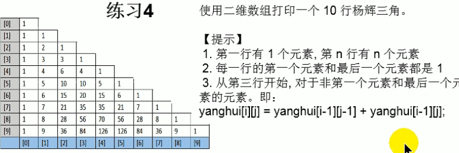
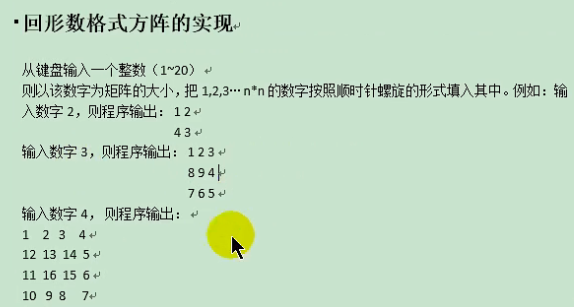

```java

import java.util.Scanner;

public class PascalTriangle {
    public static void main(String[] args) {
        System.out.println("请输入杨辉三角的行数: ");
        int line = new Scanner(System.in).nextInt();
        int[][] pascalTriangle = new int[line][];//二维数组相比一维数组多了待定的优势
        //给数组中首末元素赋值
        for (int i = 0; i < line; i++) {
            pascalTriangle[i] = new int[i + 1];
            pascalTriangle[i][0] = 1;
            pascalTriangle[i][i] = 1;
            //给非首末元素赋值
                for (int j = 1; j < i ; j++) {
                    pascalTriangle[i][j] = pascalTriangle[i - 1][j] + pascalTriangle[i - 1][j - 1];
                }
        }
        //遍历输出数组元素
        for (int[] i : pascalTriangle) {
            for (int j : i) {
                System.out.print(j + " ");
            }
            System.out.println();
        }
    }
}
```

### 回形数的实现


```java
import java.util.Scanner;

public class MultidimensionalArray {
    public static void main(String[] args) {
        System.out.println("请输入一个正整数:");
        int num = new Scanner(System.in).nextInt();
        int[][] arr = new int[num][num];
        //设置X,Y轴的最大,最小索引作为指针
        int maxX = num - 1;
        int maxY = num - 1;
        int minX = 0;
        int minY = 0;
        int count = 0;
        //根据回形数规律用指针移动循环赋值, 同时指针最值不可颠倒
        while (maxX >= minX) {
            for (int i = minX; i <= maxX; i++) {
                arr[minY][i] = ++count;
            }
            minY++;
            for (int i = minY; i <= maxY; i++) {
                arr[i][maxX] = ++count;
            }
            maxX--;
            for (int i = maxX; i >= minX; i--) {
                arr[maxY][i] = ++count;
            }
            maxY--;
            for (int i = maxY; i >= minY; i--) {
                arr[i][minX] = ++count;
            }
            minX++;
        }
        //遍历输出数组
        for (int[] i : arr) {
            for (int j : i) {
                System.out.print(j + "\t");
            }
            System.out.println();
        }
    }
}

```
