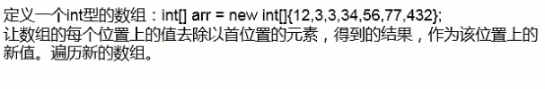

```java
import java.util.Scanner;

public class ArrayTest {
    public static void main(String[] args) {
        System.out.println("请输入数组长度: ");
        int number = new Scanner(System.in).nextInt();
        int[] arr = new int[number];
        //给数组赋值
        for (int i = 0; i < number; i++) {
            arr[i] = (int) (Math.random() * 100);
        }
        //求数组最大值
        int max = arr[0];
        for (int i : arr) {
            if (max < i) {
                max = i;
            }
        }
        System.out.println("最大值为" + max);
        //求最小值
        int min = arr[0];
        for (int i : arr) {
            if (min > i) {
                min = i;
            }
        }
        System.out.println("最小值:" + min);
        //求数组的总和
        int sum = 0;
        for (int i : arr) {
            sum += i;
        }
        System.out.println("总和为" + sum);
        //求数组的平均数
        double avg = (double) sum / number;
        System.out.println("平均数为" + avg);
        //数组的复制
        int[] arr2 = new int[arr.length];
        System.arraycopy(arr, 0, arr2, 0, arr.length);
        //数组的反转
        for (int i = 0; i < arr.length / 2; i++) {
            int temp = arr[i];
            arr[i] = arr[arr.length - 1 - i];
            arr[arr.length - 1 - i] = temp;
        }
        //遍历输出
        for (int i : arr) {
            System.out.print(i + "\t");
        }
    }
}

```

### 微软题目


```java
public class ArrayTest {
    public static void main(String[] args) {
        int[] arr = new int[]{12, 3, 3, 34, 56, 77, 432};
        for (int i = arr.length - 1; i >= 0; i--) {
            arr[i] = arr[i]/arr[0];
        }
    }
}
```
