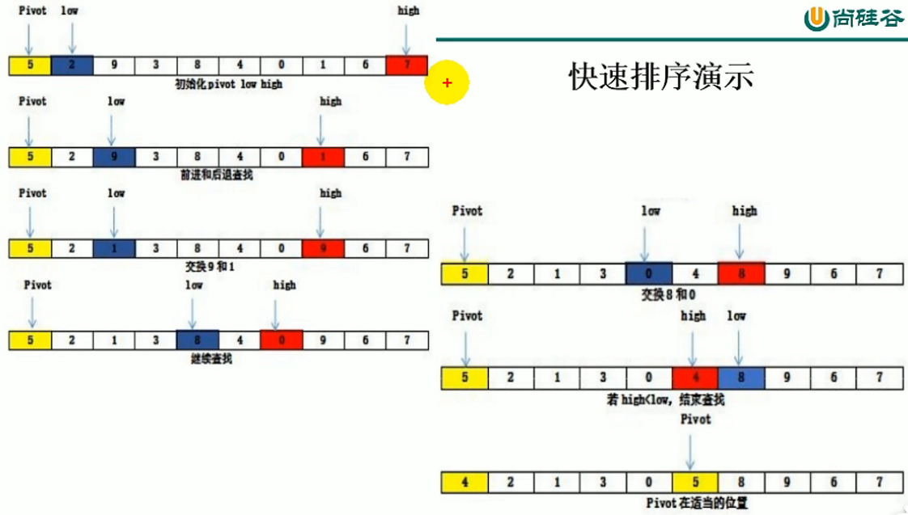

```java
import java.util.Arrays;

public class QuickSort {
    public static void main(String[] args) {
        int[] arr = new int[]{5, 2, 9, 3, 8, 4, 0, 1, 6, 7};
        quickSort(arr, 0, arr.length - 1);
        System.out.println(Arrays.toString(arr));
    }

    //从数组的left元素到right元素进行快速排序
    public static void quickSort(int[] arr, int left, int right) {
        if (left > right) {
            return;
        }
        int pivot = arr[left];
        int low = left;
        int high = right;
        //循环的开启条件是low high不等
        while (low != high) {
            //low指针找到比pivot数大的值停下
            while (arr[high] >= pivot && low < high) {
                high--;
            }
            //high指针找到比pivot小的数停下
            while (arr[low] <= pivot & low < high) {
                low++;
            }
            int temp = arr[low];
            arr[low] = arr[high];
            arr[high] = temp;
        }
        //两个指针重合的时候交换pivot
        arr[left] = arr[low];
        arr[low] = pivot;
        //左边递归, 右边递归
        quickSort(arr, left, low - 1);
        quickSort(arr, low + 1, right);
    }
}

```
### Array类快速排序
```java
    import java.util.Arrays;

public class QuickSort {
    public static void main(String[] args){
        int[] arr = new int[]{43, 23, 55, 78, 69, 25, 99, 13, 37};
        Arrays.sort(arr);
        System.out.println(Arrays.toString(arr));
    }
}
```