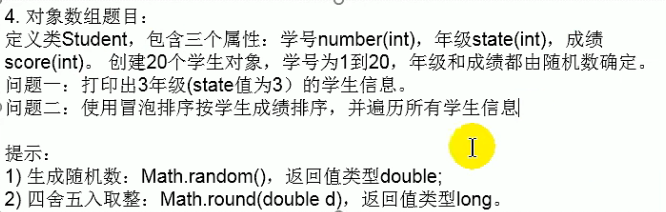

```java
public class Person {
    int age;
    String name;
    boolean isMale = true;
    public void eat(){
    }
    public void sleep(){
    }
    public void talk(){
    }
}
```

### 构造一个计算圆面积的类

```java
public class Circle {
    double radius;
    public double findArea() {
        return Math.PI * radius * radius;
    }
}

```

### 构造一个学生数组类



```java
public class Students {
    int studentID;
    int state;
    int score;

    public static void bubbleSort(Students[] students1) {
        for (int i = 0; i < students1.length - 1; i++) {
            for (int j = 0; j < students1.length - 1 - i; j++) {
                if (students1[j].score > students1[j + 1].score) {
                    int temp = students1[j + 1].score;
                    students1[j + 1].score = students1[j].score;
                    students1[j].score = temp;
                }
            }
        }
    }

```
```java
public class StudentsTest {
    public static void main(String[] args) {
        //创建20个Students[]数组
        Students[] students = new Students[20];
        //给对象赋值
        int count = 0;
        for (int i = 0; i < students.length; i++) {
            students[i] = new Students();//创建了20个Students对象
            students[i].studentID = ++count;
            students[i].state = (int) (Math.random() * 6 + 1);
            students[i].score = (int) (Math.random() * 100);
        }
        Students.bubbleSort(students);
        for (Students i : students)
            System.out.println("学生学号为" + i.studentID + "年级是" + i.state + "成绩为" + i.score);
    }
}

```