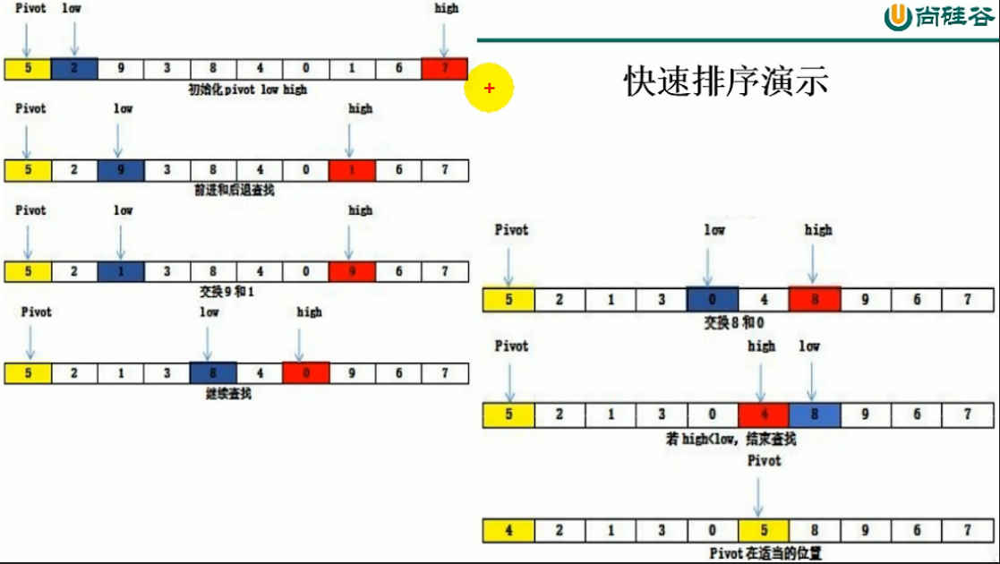

### 就算100以内自然数的和

```java
public class RecursiveMethod {
    public static void main(String[] args) {
        System.out.println(getSum(100));
    }

    public static int getSum(int n) {
        if (n == 1) {
            return 1;
        } else {
            return n + getSum(n - 1);
        }
    }
}
```

### 台阶问题

台阶问题: 每次只能踏1个台阶或2个台阶, n个台阶有几种走法?
f(n) = f(n-1) +f(n-2)

```java
public class RecursiveMethod {
    public static void main(String[] args) {
        System.out.println(recursiveFunction(3));
    }

    public static int recursiveFunction(int n) {
        if (n == 1) {
            return 1;
        } else if (n == 2) {
            return 2;
        } else {
            return recursiveFunction(n - 1) + recursiveFunction(n - 2);
        }
    }
}

```

### 斐波拉契数列

```java
public class RecursiveMethod {
    public static void main(String[] args) {
        for (int i = 0; i < 10; i++)
            System.out.print(fibonacci(i) + " ");//0 1 1 2 3 5 8 13 21 34 
    }

    public static int fibonacci(int n) {
        if (n == 0) {
            return 0;
        } else if (n == 1) {
            return 1;
        } else {
            return fibonacci(n - 1) + fibonacci(n - 2);
        }
    }
}
```

### 汉诺塔问题

```java
import java.util.Scanner;

public class Hanoi {
    public static void main(String[] args) {
        System.out.println("请输入汉诺塔层数:");
        int n = new Scanner(System.in).nextInt();
        move(n, 'A', 'B', 'C');
    }

    public static void move(int n, char A, char B, char C) {
        if (n == 1) {
            System.out.println(A + "->" + C);
        } else {
            move(n - 1, A, C, B);//把A上的n-1层搬到B
            move(1, A, B, C);//把A上最大的层搬到C
            move(n - 1, B, A, C);//把B上的层数搬到C
        }
    }
}

```

### 快速排序



```java
import java.util.Arrays;

public class QuickSort {
    public static void main(String[] args) {
        int[] arr = new int[]{5, 2, 9, 3, 8, 4, 0, 1, 6, 7};
        quickSort(arr, 0, arr.length - 1);
        System.out.println(Arrays.toString(arr));
    }

    //提供三个参数为了使用递归
    public static void quickSort(int[] arr, int left, int right) {
        //递归的终止条件
        if (left > right) {
            return;
        }
        int pivot = arr[left];
        int low = left;
        int high = right;
        //循环的开启条件是low high不等 如果改成low < high 则可能发生low于high不再相遇
        while (low != high) {
            //high指针找到比pivot小的数停下 要先移动high,否则可能会把一个大数和pivot交换
            while (arr[high] >= pivot && low < high) {
                high--;
            }
            //low指针找到比pivot数大的值停下
            while (arr[low] <= pivot && low < high) {
                low++;
            }
            int temp = arr[low];
            arr[low] = arr[high];
            arr[high] = temp;
        }
        //两个指针重合的时候交换pivot
        arr[left] = arr[low];
        arr[low] = pivot;
        //左边递归, 右边递归
        quickSort(arr, left, low - 1);
        quickSort(arr, low + 1, right);
    }
}

```
