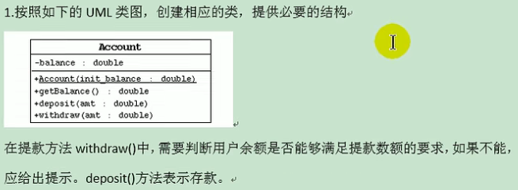
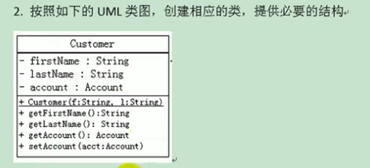
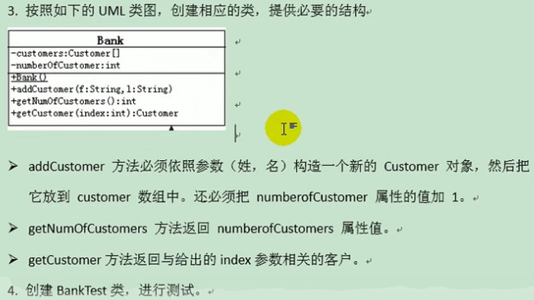

```java
public class Account {
    private double balance;

    public Account(double init_balance) {//构造器直接创建余额
        this.balance = init_balance;
    }

    public double getBalance() {
        return balance;
    }

    public void deposit(double amt) {//存钱操作
        if (amt > 0){
            balance += amt;
            System.out.println("存钱成功");
        }
    }

    public void withdraw(double amt) {//取钱操作
        if (balance >= amt){
            balance -= amt;
            System.out.println("取钱成功");
        }else{
            System.out.println("余额不足");
        }
    }
}

```



```java


public class Customer {
    private String firstname;
    private String lastname;
    private Account account;

    public Customer(String f, String l) {//构造器创建客户名字
        this.firstname = f;
        this.lastname = l;
    }

    public String getFirstname() {
        return firstname;
    }

    public String getLastname() {
        return lastname;
    }

    public Account getAccount() {
        return account;
    }

    public void setAccount(Account account) {
        this.account = account;
    }
}


```



```java
public class Bank {
    private Customer[] customers;//存放多个客户的数组 指的是容量
    private int numberOfCustomers;//记录客户的个数

    public Bank() {
        customers = new Customer[10];//创建Bank的时候,给一个长度10的数组
    }

    //添加客户
    public void addCustomer(String f, String l) {
        Customer customer = new Customer(f, l);
        customers[numberOfCustomers++] = customer;
    }

    //获取客户的个数
    public int getNumberOfCustomers() {
        return numberOfCustomers;
    }

    //获取指定位置上的客户
    public Customer getCustomer(int index) {
        if (index >= 0 && index < numberOfCustomers){
            return customers[index];
        }
        return null;
    }
}

```
### 测试类
```java
public class BankTest {
    public static void main(String[] args) {
        Bank bank = new Bank();
        bank.addCustomer("幂", "杨");
        bank.getCustomer(0).setAccount(new Account(2000));
        bank.getCustomer(0).getAccount().withdraw(500);
        System.out.println("客户"+bank.getCustomer(0).getFirstname()+"的余额为" + bank.getCustomer(0).getAccount().getBalance());

        bank.addCustomer("诗诗","刘");

        System.out.println("银行客户的个数:"+bank.getNumberOfCustomers());
    }

```