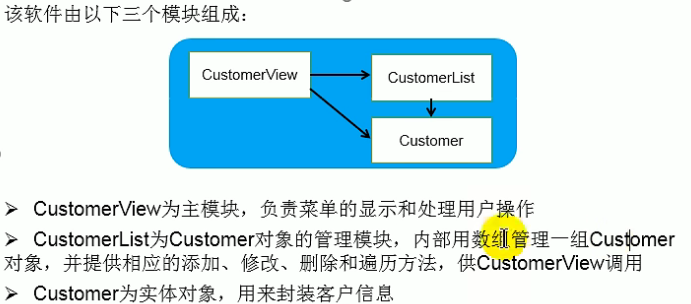

### model层
```java
package com.java.MVC.bean;

public class Customer {
    private String name;
    private char gender;
    private int age;
    private String phone;
    private String email;

    public Customer() {
    }

    public Customer(String name, char gender, int age, String phone, String email) {
        this.name = name;
        this.gender = gender;
        this.age = age;
        this.phone = phone;
        this.email = email;
    }

    public String getName() {
        return name;
    }

    public void setName(String name) {
        this.name = name;
    }

    public char getGender() {
        return gender;
    }

    public void setGender(char gender) {
        this.gender = gender;
    }

    public int getAge() {
        return age;
    }

    public void setAge(int age) {
        this.age = age;
    }

    public String getPhone() {
        return phone;
    }

    public void setPhone(String phone) {
        this.phone = phone;
    }

    public String getEmail() {
        return email;
    }

    public void setEmail(String email) {
        this.email = email;
    }
}

```
### control层
```java
package com.java.MVC.service;

import com.java.MVC.bean.Customer;

public class CustomerList {
    private Customer[] customers;
    private int total = 0;

    public CustomerList(int totalCustomer) {
        customers = new Customer[totalCustomer];
    }

    public boolean addCustomer(Customer customer) {
        if (total >= customers.length) {
            return false;
        } else {
            customers[total++] = customer;
            return true;
        }
    }

    public boolean replaceCustomer(int index, Customer customer) {
        if (index < 0 || index >= total) {
            return false;
        }
        customers[index] = customer;
        return true;
    }

    public boolean deleteCustomer(int index) {
        if (index < 0 || index >= total) {
            return false;
        }
        for (int i = index; i < total - 1 - index; i++) {
            customers[i] = customers[i + 1];
        }
        customers[--total] = null;
        return true;
    }

    public Customer[] getAllCustomers() {
        Customer[] customers1 = new Customer[total];
        System.arraycopy(customers, 0, customers1, 0, total);
        return customers1;
    }

    public Customer getCustomer(int index) {
        if (index < 0 || index >= total){
            return null;
        }
        return customers[index];
    }

    public int getTotal() {
        return total;
    }


}
```
### view层
```java
package com.java.MVC.ui;

import com.java.MVC.bean.Customer;
import com.java.MVC.service.CustomerList;
import com.java.MVC.util.CMUtility;

public class CustomerView {
    private CustomerList customerList = new CustomerList(10);

    public CustomerView() {
        Customer customer = new Customer("张三", '男', 20, "12345678909", "dsuy@qq.com");
        customerList.addCustomer(customer);
    }

    public static void main(String[] args) {
        CustomerView view = new CustomerView();
        view.enterMainMenu();
    }

    public void enterMainMenu() {
        boolean isFlag = true;
        while (isFlag) {
            System.out.println("\n-----------------客户信息管理软件-----------------\n");
            System.out.println("                   1 添 加 客 户");
            System.out.println("                   2 修 改 客 户");
            System.out.println("                   3 删 除 客 户");
            System.out.println("                   4 客 户 列 表");
            System.out.println("                   5 退       出\n");
            System.out.print("                   请选择(1-5)：");
            char menu = CMUtility.readMenuSelection();
            switch (menu) {
                case '1' -> addNewCustomer();
                case '2' -> modifyCustomer();
                case '3' -> deleteCustomer();
                case '4' -> listAllCustomer();
                case '5' -> {
                    System.out.println("确认是否退出: ");
                    char isExit = CMUtility.readConfirmSelection();
                    if (isExit == 'Y') {
                        isFlag = false;
                    }
                }
            }

        }
    }

    public void addNewCustomer() {
        System.out.println("---------------------添加客户---------------------");
        System.out.print("姓名：");
        String name = CMUtility.readString(10);
        System.out.print("性别：");
        char gender = CMUtility.readChar();
        System.out.print("年龄：");
        int age = CMUtility.readInt();
        System.out.print("电话：");
        String phone = CMUtility.readString(13);
        System.out.print("邮箱：");
        String email = CMUtility.readString(30);

        Customer customer = new Customer(name, gender, age, phone, email);
        boolean isSuccess = customerList.addCustomer(customer);
        if (isSuccess) {
            System.out.println("---------------------添加完成---------------------");
        } else {
            System.out.println("-------------------客户目录已满，添加失败---------------");
        }
    }

    public void modifyCustomer() {
        System.out.println("---------------------修改客户---------------------");
        Customer customer;
        int number;
        while (true) {
            System.out.println("请选择待修改客户编号(-1退出)：");
            number = CMUtility.readInt();
            if (number == -1) {
                return;
            }
            customer = customerList.getCustomer(number - 1);
            if (customer == null) {
                System.out.println("无法找到指定的客户!");
            } else {
                break;
            }
        }
        System.out.print("姓名(" + customer.getName() + "):");
        String name = CMUtility.readString(10, customer.getName());
        System.out.print("性别(" + customer.getGender() + "):");
        char gender = CMUtility.readChar(customer.getGender());
        System.out.print("年龄(" + customer.getAge() + "):");
        int age = CMUtility.readInt(customer.getAge());
        System.out.print("电话(" + customer.getPhone() + "):");
        String phone = CMUtility.readString(13, customer.getPhone());
        System.out.print("邮箱(" + customer.getEmail() + "):");
        String email = CMUtility.readString(30, customer.getEmail());

        Customer newCustomer = new Customer(name, gender, age, phone, email);
        boolean isReplaced = customerList.replaceCustomer(number - 1, newCustomer);
        if (isReplaced) {
            System.out.println("---------------------修改完成---------------------");
        } else {
            System.out.println("---------------------修改失败---------------------");
        }
    }

    public void deleteCustomer() {
        System.out.println("---------------------删除客户---------------------");
        int number;
        Customer customer;
        while(true){
            System.out.println("请选择待修改客户编号(-1退出)：");
            number = CMUtility.readInt();
            if(number == -1) {
                return;
            }
            customer = customerList.getCustomer(number - 1);
            if(customer == null) {
                System.out.println("无法找到指定客户！");
            }else {
                break;
            }
        }

        System.out.print("确认是否删除(Y/N)：");
        char isDelete = CMUtility.readConfirmSelection();
        if(isDelete == 'Y'){
            boolean deleteSuccess = customerList.deleteCustomer(number - 1);
            if(deleteSuccess){
                System.out.println("---------------------删除完成---------------------");
            }else{
                System.out.println("---------------------删除失败---------------------");
            }
        }
    }

    public void listAllCustomer() {
        System.out.println("---------------------------客户列表---------------------------");
        int total = customerList.getTotal();
        if (total == 0) {
            System.out.println("没有客户记录!");
        } else {
            System.out.println("编号\t姓名\t性别\t年龄\t电话\t\t邮箱");
            Customer[] customers = customerList.getAllCustomers();
            for (int i = 0; i < customers.length; i++) {
                Customer customer = customers[i];
                System.out.println((i + 1) + "\t\t" + customer.getName() +
                        "\t" + customer.getGender() + "\t\t" + customer.getAge() +
                        "\t\t" + customer.getPhone() + "\t" + customer.getEmail());
            }
        }
        System.out.println("-------------------------客户列表完成-------------------------");

    }
}

```
### 工具类
```java
package com.java.MVC.util;

import java.util.Scanner;

public class CMUtility {
    private static Scanner scanner = new Scanner(System.in);

    //用户输入1~5 返回方法
    public static char readMenuSelection() {
        char c;
        while (true) {
            String str = readKeyboard(1, false);
            c = str.charAt(0);
            if (c != '1' && c != '2' && c != '3' && c != '4' && c != '5') {
                System.out.println("输入错误, 请重新输入: ");
            } else break;
        }
        return c;
    }

    //读取性别
    public static char readChar() {
        String str = readKeyboard(1, false);
        return str.charAt(0);
    }

    //重载,修改性别时
    public static char readChar(char defaultValue) {
        String str = readKeyboard(1, true);
        return (str.length() == 0) ? defaultValue : str.charAt(0);
    }

    //读取年龄
    public static int readInt() {
        int n;
        while (true) {
            String str = readKeyboard(2, false);
            try {
                n = Integer.parseInt(str);
                break;
            } catch (NumberFormatException e) {
                System.out.println("数字输入错误, 请重新输入: ");
            }
        }
        return n;
    }
    public static int readInt(int defaultValue) {
        int n;
        while(true) {
            String str = readKeyboard(2, true);
            if (str.equals("")) {
                return defaultValue;
            }

            try {
                n = Integer.parseInt(str);
                break;
            } catch (NumberFormatException e) {
                System.out.print("数字输入错误，请重新输入：");
            }
        }
        return n;
    }
    //读取电话号码
    public static String readString(int limit) {
        return readKeyboard(limit, false);

    }

    //重载 修改电话号码
    public static String readString(int limit, String defaultValue) {
        String str = readKeyboard(limit, true);
        return str.equals("") ? defaultValue : str;
    }

    //读取Y,N 确认
    public static char readConfirmSelection() {
        char c;
        while (true) {
            String str = readKeyboard(1, false).toUpperCase();
            c = str.charAt(0);
            if (c == 'Y' || c == 'N'){
                break;
            }else{
                System.out.print("选择错误, 请重新输入: ");
            }
        }
        return c;
    }

    //对键盘获取值并检查, limit是限制字数, blankReturn问是否接受空白输入
    private static String readKeyboard(int limit, boolean blankReturn) {
        String line = "";
        while (scanner.hasNextLine()) {//判断输入有没有空行
            line = scanner.nextLine();
            if (line.length() == 0) {
                if (blankReturn)
                    return line;
                else continue;
            }
            if (line.length() > limit) {//至少输入一个字符且不超过limit
                System.out.println("输入长度(不大于" + limit + ")错误,请重新输入");
                continue;
            }
            break;
        }
        return line;
    }
}
```
